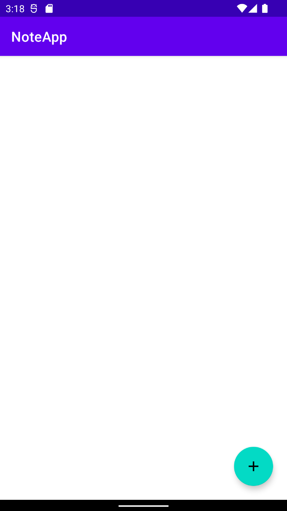
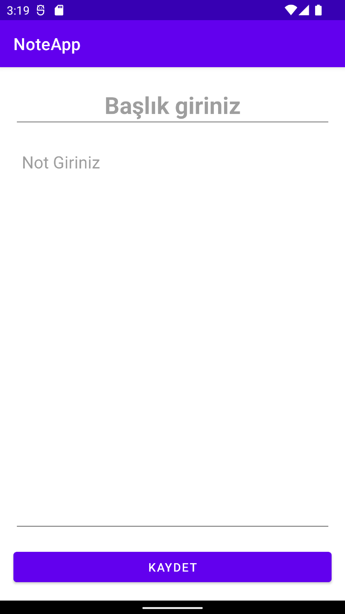
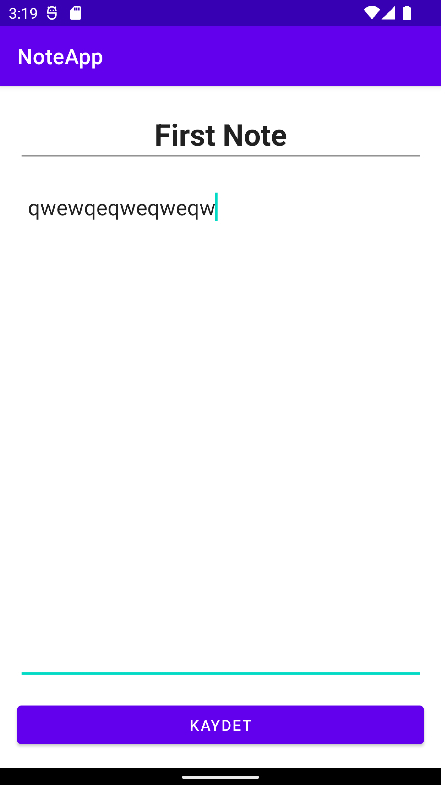
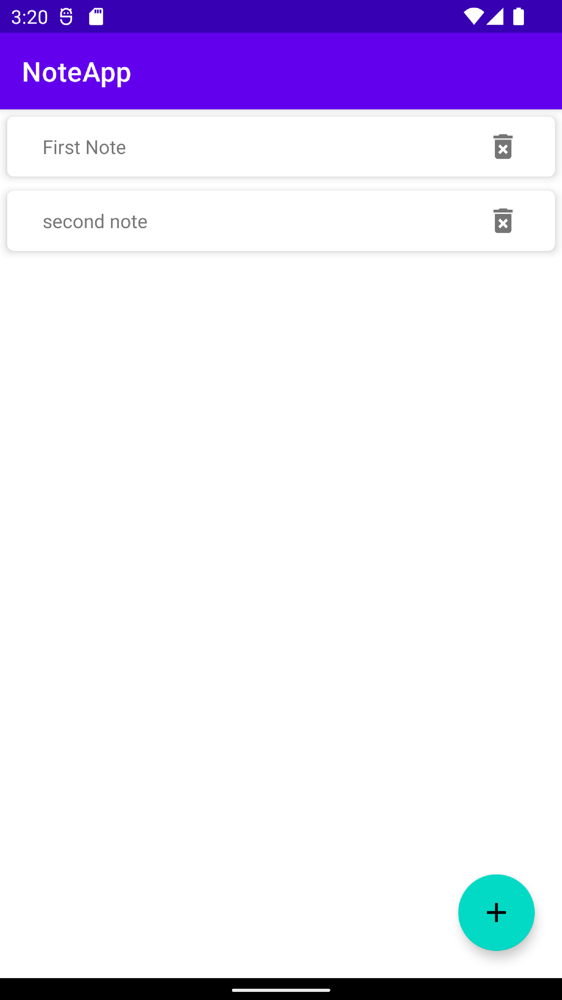
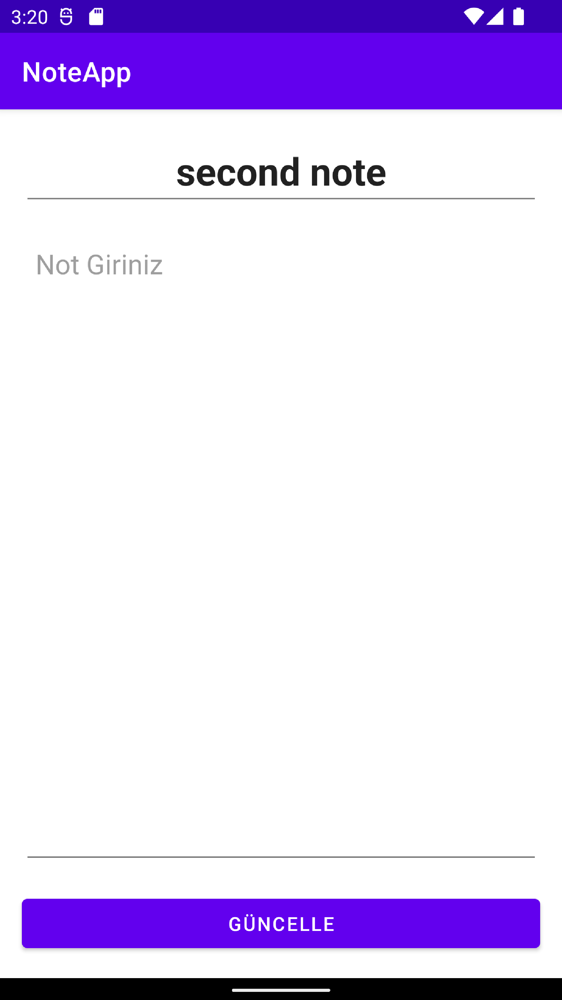

# NoteApp

<h3>Libraries used in this project<h3>
<ul>
  
  <li><a href="https://developer.android.com/jetpack/androidx/releases/room" target="_blank">Room</a></li>

  <li><a href="https://developer.android.com/topic/libraries/architecture/viewmodel" target="_blank">ViewModel</a></li>
  
  <li><a href="https://developer.android.com/topic/libraries/view-binding" target="_blank">ViewModel</a></li>
  
 </ul>

 

 

 

 

  
